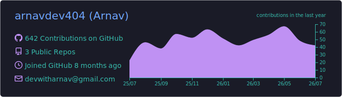

<h1 align="center">Hi 👋, I'm Arnav Anand</h1>

<h3 align="center">
  Full Stack Developer | Building Today for a Better Tomorrow.
</h3>

  Building scalable web applications with modern technologies while continuously learning and contributing to open source.

  

---

## 📊 GitHub Analytics

  

## 🚀 Current Project

### 🌦️ Arnav Weather Web

  

  A responsive weather dashboard providing real-time weather,
  hourly forecasts, five-day forecasts and air-quality information.

  

  

## 🌱 Currently Learning

<table> <tr> <td width="35%" align="center">  </td> <td width="65%"> - ⚛️ React.js - ▲ Next.js - 🟢 Node.js - 🚀 Express.js - 🍃 MongoDB - 🔷 TypeScript - 🌿 Git & GitHub - 🔗 REST APIs </td> </tr> </table>

## 🤝 Looking to Collaborate

Open Source • MERN Stack Projects • Full Stack Applications

---

## 💬 Ask Me About

HTML • CSS • JavaScript • React • Git • GitHub • C • C++ • Python

---

## 🛠 Tech Stack

  
  &nbsp;
  
  &nbsp;
  
  &nbsp;
  
  &nbsp;
  
  &nbsp;
  
  &nbsp;
  
  &nbsp;
  
  &nbsp;
  
  &nbsp;
  
  &nbsp;
  
  &nbsp;
  
  &nbsp;
  
  &nbsp;
  

---

## 🌐 Connect With Me

  

  

  

---

## 🌍 Portfolio

### 🚀 Explore My Developer Portfolio

  Discover my projects, skills, experience, and journey as a developer.

  

  
  
  

---

## ⚡ Fun Fact

> Building Today for a Better Tomorrow.

---

  

